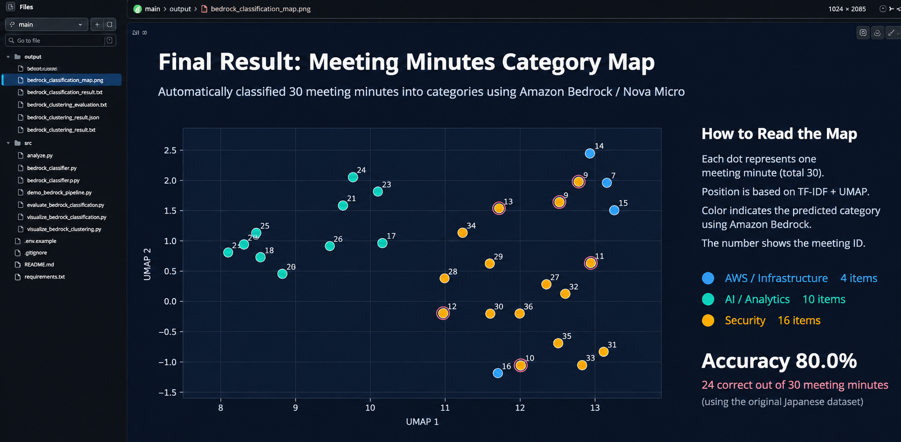

# AWS Meeting Minutes Analytics & AI-Powered Classification

**AWS × Amazon Bedrock × PostgreSQL × Python**

An end-to-end cloud and generative AI engineering portfolio project that automatically classifies Japanese meeting minutes stored in Amazon RDS for PostgreSQL using **Amazon Bedrock (Amazon Nova Micro)** and visualizes document relationships using **TF-IDF and UMAP**.

## 1. Project Overview

This project demonstrates the integration of AWS cloud infrastructure, private database connectivity, generative AI, Python automation, data visualization, and classification evaluation.

The demonstration uses **30 synthetic Japanese meeting minutes**. No real customer data or confidential business information is included.

### Key Features

- Meeting minutes storage in Amazon RDS for PostgreSQL
- Secure private database access through AWS Systems Manager
- Automated document classification using Amazon Bedrock
- Amazon Nova Micro inference through the Converse API
- Python integration using boto3 and psycopg2
- Persistence of AI predictions in PostgreSQL
- Japanese text feature extraction using TF-IDF
- Two-dimensional visualization using UMAP and Matplotlib
- Classification accuracy evaluation

## 2. System Architecture

```text
Windows 11 / Visual Studio Code
              |
              | AWS CLI
              | SSM Port Forwarding
              v
          Amazon EC2
      (SSM-managed instance)
              |
              v
    Amazon RDS PostgreSQL
       meeting_minutes
              ^
              |
       Python / psycopg2
              |
              v
    Retrieve 30 documents
              |
              v
        Amazon Bedrock
        Amazon Nova Micro
              |
              v
    Predict 3 categories
              |
              v
    Store predictions in
     RDS (ai_category)
              |
              v
        TF-IDF + UMAP
              |
              v
    Classification Map
              |
              v
    Accuracy Evaluation
```

The development and Python execution environment runs locally on Windows 11 using Visual Studio Code.

Amazon EC2 provides a secure connection path to the private RDS database through AWS Systems Manager.

The Python application invokes Amazon Bedrock directly using boto3.

## 3. Technology Stack

| Area | Technology | Purpose |
|---|---|---|
| Cloud | AWS | Infrastructure platform |
| Compute | Amazon EC2 | SSM connection intermediary |
| Database | Amazon RDS for PostgreSQL | Document and prediction storage |
| Generative AI | Amazon Bedrock | Managed model inference |
| Foundation Model | Amazon Nova Micro | Document classification |
| Security | AWS IAM | Access control |
| Operations | AWS Systems Manager | Secure database connectivity |
| Programming | Python | Data processing and automation |
| AWS SDK | boto3 | Bedrock API integration |
| Database Driver | psycopg2 | PostgreSQL operations |
| Japanese NLP | SudachiPy | Tokenization |
| Feature Extraction | TF-IDF | Text vectorization |
| Dimensionality Reduction | UMAP | Two-dimensional document mapping |
| Visualization | Matplotlib / SciPy | Classification visualization |

## 4. AI-Powered Document Classification

### Dataset

The project uses 30 synthetic Japanese meeting minutes stored in the PostgreSQL `meeting_minutes` table.

### Classification Categories

| Category | Example Topics |
|---|---|
| AWS / Infrastructure | VPC, EC2, RDS, Terraform, S3, CloudWatch |
| AI / Analytics | LLM, RAG, Python, TF-IDF, UMAP, Embeddings |
| Security | IAM, KMS, CloudTrail, WAF, GuardDuty |

### Processing Workflow

1. Retrieve document titles and content from PostgreSQL.
2. Invoke Amazon Nova Micro through the Amazon Bedrock Converse API.
3. Predict one of three predefined categories.
4. Store the prediction in the `ai_category` database column.
5. Compare predictions against predefined ground-truth labels.
6. Calculate classification accuracy.
7. Visualize document relationships using TF-IDF and UMAP.

Ground-truth labels are used for evaluation and are not provided to the model as part of the classification prompt.

## 5. Evaluation Results

Amazon Nova Micro classified all 30 synthetic meeting minutes.

### Classification Accuracy

| Metric | Result |
|---|---:|
| Documents evaluated | 30 |
| Model | Amazon Nova Micro |
| Categories | 3 |
| Correct predictions | 24 |
| Incorrect predictions | 6 |
| **Accuracy** | **80.0%** |

### Predicted Category Distribution

| Predicted Category | Documents |
|---|---:|
| AWS / Infrastructure | 4 |
| AI / Analytics | 10 |
| Security | 16 |
| **Total** | **30** |

The model correctly classified 24 out of 30 documents.

The predictions showed an uneven category distribution, with more documents assigned to the Security category.

These results are based on a small synthetic dataset and should not be interpreted as production-level performance.

## 6. Classification Visualization

The project uses TF-IDF and UMAP to map Japanese meeting minutes into a two-dimensional space.



### How to Interpret the Visualization

- **Each point:** One meeting document
- **Point position:** Document features represented through TF-IDF and UMAP
- **Point color:** Category predicted by Amazon Nova Micro
- **Numeric label:** Meeting minutes ID
- **Red outline:** Incorrect classification compared with the ground-truth category

Amazon Nova Micro performs the actual classification.

TF-IDF and UMAP are used for feature representation and visualization, not for determining the predicted category.

The visualized dataset contains Japanese documents, while this README provides English documentation for international audiences.

## 7. Development Environment

- Operating system: Windows 11
- IDE: Visual Studio Code
- Terminal: PowerShell
- Programming language: Python
- AWS Region: Asia Pacific (Tokyo), `ap-northeast-1`
- Database: Amazon RDS for PostgreSQL
- Generative AI: Amazon Bedrock / Amazon Nova Micro

## 8. Getting Started

### 8.1 Install Dependencies

```powershell
python -m pip install boto3 psycopg2-binary python-dotenv numpy scipy scikit-learn umap-learn sudachipy sudachidict-core matplotlib
```

### 8.2 Configure Environment Variables

Create a `.env.local` file in the project root.

```dotenv
DB_HOST=127.0.0.1
DB_PORT=15432
DB_NAME=minutesdb
DB_USER=YOUR_DB_USER
DB_PASSWORD=YOUR_DB_PASSWORD
AWS_PROFILE=YOUR_AWS_PROFILE
AWS_REGION=ap-northeast-1
```

Do not commit credentials or local environment files to GitHub.

### 8.3 Establish an SSM Port Forwarding Session

Use a managed EC2 instance with network access to the private RDS endpoint.

```powershell
aws ssm start-session `
  --target YOUR_EC2_INSTANCE_ID `
  --document-name AWS-StartPortForwardingSessionToRemoteHost `
  --parameters '{"host":["YOUR_RDS_ENDPOINT"],"portNumber":["5432"],"localPortNumber":["15432"]}' `
  --region ap-northeast-1 `
  --profile YOUR_AWS_PROFILE
```

Keep this session running and open another PowerShell terminal to execute the Python commands.

### 8.4 Seed the Demonstration Dataset

```powershell
python .\src\demo_bedrock_pipeline.py seed
```

### 8.5 Classify Documents with Amazon Bedrock

```powershell
python .\src\demo_bedrock_pipeline.py classify
```

### 8.6 Run the Visualization Workflow

```powershell
python .\src\demo_bedrock_pipeline.py visualize
```

### 8.7 View the Saved Classification Map

```powershell
Start-Process .\output\bedrock_classification_map.png
```

**Note:** The published classification map is an existing project artifact. The visualization command may require troubleshooting or adjustments to reproduce the exact saved image in another environment.

## 9. Repository Structure

```text
aws-bedrock-minutes-analytics/
├── README.md
├── .gitignore
├── .env.example
├── requirements.txt
├── src/
│   ├── analysis.py
│   ├── bedrock_classifier.py
│   ├── bedrock_clustering.py
│   ├── demo_bedrock_pipeline.py
│   ├── evaluate_bedrock_clustering.py
│   ├── visualize_bedrock_classification.py
│   └── visualize_bedrock_clustering.py
└── output/
    ├── analysis_result.txt
    ├── bedrock_classification_map.png
    ├── bedrock_classification_result.txt
    ├── bedrock_clustering_evaluation.txt
    ├── bedrock_clustering_result.json
    └── bedrock_clustering_result.txt
```

### Main Demonstration Script

`src/demo_bedrock_pipeline.py`

This script provides the demonstration commands for dataset creation, Bedrock classification, and visualization.

The repository also includes scripts and output artifacts from separate document clustering experiments.

## 10. Security Considerations

- PostgreSQL is deployed in a private network.
- Database connectivity is established through AWS Systems Manager.
- EC2 administration does not require publicly exposing SSH.
- AWS IAM controls access to AWS services.
- Database credentials are excluded from version control.
- Only synthetic meeting minutes are used for testing.

## 11. Engineering Skills Demonstrated

### AWS Cloud Engineering

- EC2 and RDS integration
- Private database connectivity
- IAM permissions and troubleshooting
- AWS Systems Manager port forwarding

### Generative AI and Data Engineering

- Amazon Bedrock Converse API integration
- Python automation using boto3
- Japanese document classification
- PostgreSQL data persistence
- TF-IDF text feature extraction
- UMAP dimensionality reduction
- Matplotlib data visualization
- Classification accuracy evaluation

### Development and Operations

- Windows 11 and Visual Studio Code development
- Python virtual environments
- AWS CLI operations
- Git and GitHub version control
- Debugging and technical documentation

## 12. Future Improvements

- Investigate the six misclassified documents
- Improve classification prompts
- Evaluate Precision, Recall, and F1-score
- Expand the evaluation dataset
- Add automated Python tests
- Introduce CI/CD workflows

---

**Project Type:** Independent cloud and generative AI engineering portfolio

**AWS Region:** Asia Pacific (Tokyo), `ap-northeast-1`

**Dataset:** 30 synthetic Japanese meeting minutes

**Classification Accuracy:** 80.0%

**Japanese Version:** https://github.com/mika-it-labs/minutes-analytics
